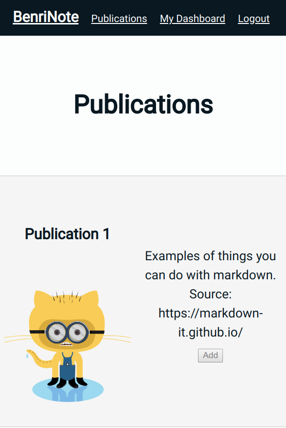

This project was bootstrapped with [Create React App](https://github.com/facebook/create-react-app).

# benrinote-app 

This is a note-taking react-application that uses this api. 
[Benrinote app github](https://github.com/levipaulk/benrinote-app)
[Benrinote api github](https://github.com/levipaulk/benrinote-api)
[Live](https://levi-benrinote-app.now.sh/)

After registration and login, the user can:
<!--  -->

1. Browse from a list of available ==Publications==
2. View their list of ==Publications== on their ==Dashboard==
3. Read any of their ==Publications== 
  + ==Publications== are divided into ==Sections==
4. Take ==Notes== on individual ==Sections==
  + Each ==Section== has an associated section of ==Notes==
  + ==Notes== are generated in the database when a User adds a ==Publication== to their ==Dashboard==
  + ==Notes== are saved to the database through an onBlur event
  + As a failsafe, the User's last-edited ==Note== is saved in Local Memory
    + When either the ==Publication== or ==Compiled Notes== are about to be mounted,
    + The application will check for any unsaved note, saving it to the database if found
5. View their ==Notes==, grouped by ==Publication==

## Available Scripts

In the project directory, you can run:

### `npm start`

Runs the app in the development mode. 
Open [http://localhost:3000](http://localhost:3000) to view it in the browser.

The page will reload if you make edits. 
You will also see any lint errors in the console.

### `npm test`

Launches the test runner in the interactive watch mode. 
See the section about [running tests](https://facebook.github.io/create-react-app/docs/running-tests) for more information.

### `npm run build`

Builds the app for production to the `build` folder. 
It correctly bundles React in production mode and optimizes the build for the best performance.

The build is minified and the filenames include the hashes. 
Your app is ready to be deployed!

See the section about [deployment](https://facebook.github.io/create-react-app/docs/deployment) for more information.

### `npm run eject`

**Note: this is a one-way operation. Once you `eject`, you can’t go back!**

If you aren’t satisfied with the build tool and configuration choices, you can `eject` at any time. This command will remove the single build dependency from your project.

Instead, it will copy all the configuration files and the transitive dependencies (Webpack, Babel, ESLint, etc) right into your project so you have full control over them. All of the commands except `eject` will still work, but they will point to the copied scripts so you can tweak them. At this point you’re on your own.

You don’t have to ever use `eject`. The curated feature set is suitable for small and middle deployments, and you shouldn’t feel obligated to use this feature. However we understand that this tool wouldn’t be useful if you couldn’t customize it when you are ready for it.

## Example .env.local

REACT_APP_API_KEY="you-secret-here"
REACT_APP_API_BASE_URL="https://your-url-here"

## Test User

-Username: dunder
-Password: password

## F.A.Q
-"What does 'benrinote' mean?"
  + benri, a.k.a. べんり or 便利, roughly translates to 'convenient'
  + benri is more-or-less pronounced as 'ben-ree'

## Learn More

You can learn more in the [Create React App documentation](https://facebook.github.io/create-react-app/docs/getting-started).

To learn React, check out the [React documentation](https://reactjs.org/).

### Code Splitting

This section has moved here: https://facebook.github.io/create-react-app/docs/code-splitting

### Analyzing the Bundle Size

This section has moved here: https://facebook.github.io/create-react-app/docs/analyzing-the-bundle-size

### Making a Progressive Web App

This section has moved here: https://facebook.github.io/create-react-app/docs/making-a-progressive-web-app

### Advanced Configuration

This section has moved here: https://facebook.github.io/create-react-app/docs/advanced-configuration

### Deployment

This section has moved here: https://facebook.github.io/create-react-app/docs/deployment

### `npm run build` fails to minify

This section has moved here: https://facebook.github.io/create-react-app/docs/troubleshooting#npm-run-build-fails-to-minify
